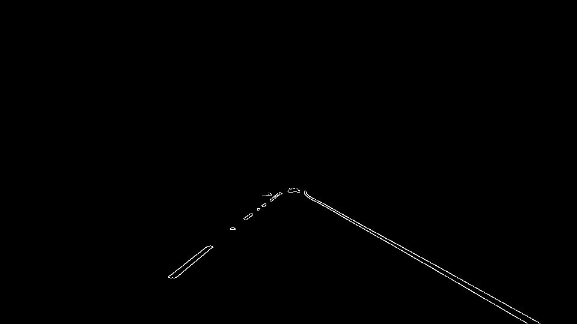

# **Finding Lane Lines on the Road**

[//]: # (Image References)

[gray_image]: ./test_images_output/gray-solidWhiteCurve.jpg "Grayscale Image"
[blur_image]: ./test_images_output/blur-solidWhiteCurve.jpg "Blurred Image"
[canny_image]: ./test_images_output/canny-solidWhiteCurve.jpg
  "Canny-transformed Image"
[masked_image]: ./test_images_output/masked-solidWhiteCurve.jpg "Masked Image"
[hough_image]: ./test_images_output/hough-solidWhiteCurve.jpg
  "Hough-transformed Image"
[weighted_image]: ./test_images_output/weighted-solidWhiteCurve.jpg
  "Weighted Image"
[out_image]: ./test_images_output/out-solidWhiteCurve.jpg "Final Output Image"

---

## Reflection

### 1. Pipeline

Original image:

##### 1.1. Pipeline: First Pass

My pipeline consists of 7 steps.

###### Step 1. Convert the images to grayscale:

###### Step 2. Apply Gaussian Blur to the grayscale image to smooth out edges:

###### Step 3. Apply Canny transform to detect edges:

###### Step 4. Mask the image except the region of interest:

###### Step 5. Detect lines using hough transform - first pass, without
  modifying draw_lines():

###### Step 6. Overlay the detected lines with original image:

###### Step 7. Restore the order of R, G, B channels in the final output image:

##### 1.2. Pipeline: Second Pass - Improved draw_lines()
In order to draw a single line on the left and right lanes, I created a new
version of the draw_lines() function, named draw_solid_lines(), as follows:

1. Define a function fit_line that takes arrays of points (x, y coordinates)
  and fits them into a linear function y = mx + b using numpy.polyfit().
  It draws that line using the given color and thickness, only if the line is
  not too steep - i.e. m is not too low (close to horizontal line) or too high
  (close to vertical line).

2. In draw_solid_lines(), initialize lists of right and left x, y coordinates
  For each line given by hough transform, find the slope of the line, and
  append the points x1, y1, x2, y2 to either the right x, y coordinate list
  (if slope is positive), or left x, y coordinate list (if slope is negative),
  only if the line is not too steep - i.e. the slope is not too low
  (close to horizontal line) or too high (close to vertical line).

  With these improvements, the output of the last step (Step 7) is as follows:

  

### 2. Potential shortcomings with my current pipeline

My current pipeline discards entire lines in fit_line() if they are too
steep horizontally or vertically. This may result in few frames with either
left or right line missing in a given video.

### 3. Possible improvements to my pipeline

Instead of discarding entire line, identify & discard only the points
(x, y pairs) that cause slope of the line to be steeper than acceptable.
One way to do this would be by discarding points causing high
variance in the X, Y vectors.
